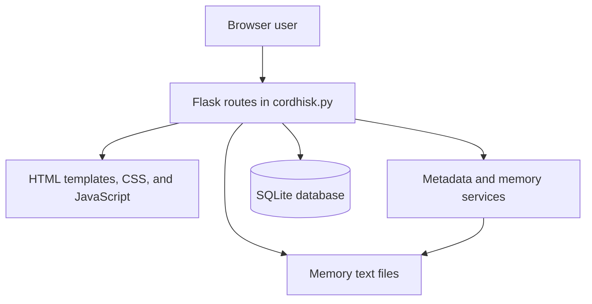

# CORDHISK: Design, Operation, and Capabilities

## 1. Purpose and scope

CORDHISK is a browser-based application for documenting community memories and connecting passages in those memories to Cultural Heritage Objects (CHOs). It supports the creation, annotation, exploration, comparison, reporting, and export of cultural-heritage metadata.

The system is designed around a simple principle: a memory remains readable as ordinary text while its descriptive metadata is embedded directly in the text as structured tags. This keeps the primary source material and the annotations close together, while allowing the application to parse, edit, aggregate, and export the metadata.

A CHO is the entity to which a passage refers, such as an object, place, person, event, building, collection, or other heritage resource. A memory can contain annotations for multiple CHOs, and one CHO can be represented across multiple memories. CORDHISK therefore supports both memory-centred and CHO-centred exploration.

## 2. High-level architecture

CORDHISK is a Python web application built with Flask and SQLAlchemy. Its architecture has four main layers:

1. **Web application layer.** `cordhisk.py` defines the Flask application, HTTP routes, request handling, navigation state, import/export actions, report generation, and data transformations used by the views.
2. **Presentation layer.** `services/web_templates.py` contains the HTML, CSS, and JavaScript templates for the main workspace, search, import, compare, and report views. Templates are rendered directly by Flask.
3. **Domain-service layer.** The `services/` directory contains metadata parsing, schema definitions, metadata types, and text-rebuilding functions. These modules keep the logic for interpreting and rewriting embedded metadata separate from the HTTP routes.
4. **Persistence layer.** `db.py` defines the SQLite-backed `Memory` and `CHO` models. The database and application-managed memory text files are stored in `memory_files/`.

The application intentionally has a compact deployment model. It runs as a single Flask process and does not require a separate frontend build system, API service, or external database server.



## 3. Core data model

CORDHISK stores two primary record types:

- **Memory.** A memory has an internal database ID, a user-facing identifier (`custom_id`), title, full text, file path, and optional license. The full text includes the original narrative plus embedded metadata.
- **CHO.** A Cultural Heritage Object has an internal database ID, a user-facing identifier, and title. CHO-specific descriptive values are stored as annotations in related memory texts rather than as a fixed set of columns on the CHO record.

The separation is deliberate. The `CHO` table records the identity of the heritage resource, while its descriptive metadata can vary between memories. This allows CORDHISK to retain different community descriptions, names, dates, or interpretations instead of forcing a single authoritative value.

### Embedded metadata format

Memory-level metadata is stored in a protected metadata block at the beginning of a memory:

```text
=== MEMORY METADATA START ===
<dc:identifier type="memory">M-001</dc:identifier>
<dc:title type="memory">A memory title</dc:title>
<dc:license type="memory">CC BY</dc:license>
=== MEMORY METADATA END ===
```

CHO metadata is stored inline around the relevant passage:

```text
The <dc:title cho="CHO-001">Old Town Hall</dc:title> was used for meetings.
```

In this example, the visible wording remains “Old Town Hall”, while the tag states that it is the `dc:title` of CHO `CHO-001`. Metadata fields are defined in `services/metadata_schema.py` and include Dublin Core, DCTERMS, Open Annotation Framework, and RDA-oriented fields.

## 4. Metadata parsing and text preservation

`services/metadata.py` uses a regular expression-based parser to recognize the supported XML-like tags. It provides two related operations:

- `extract_metadata` returns structured metadata records for analysis, navigation, reports, and RDF export.
- `parse_text_and_spans` removes metadata markup from the visible text while recording the character spans and meaning of each annotation.

The visible-memory view is therefore clean and readable, with annotated segments highlighted rather than showing raw markup. When a user adds, edits, or deletes metadata, CORDHISK rebuilds the textual representation through `services/memory_service.py`. This process preserves the narrative content, rewrites the memory metadata block, and reconstructs CHO tags around their annotated values.

This model has practical advantages: memory files remain portable text documents, metadata travels with the memory, and the database can be regenerated or inspected independently of a proprietary annotation format.

## 5. Main workspace and navigation

The main route (`/`) presents the application workspace. It supports two complementary modes.

### Memory view

Selecting a memory loads its narrative text, memory-level metadata, CHO tags, and relationship graph. Users can:

- edit the memory identifier, title, content, metadata, and license;
- annotate selected text with a CHO and metadata field;
- remove individual metadata tags;
- filter visible CHO tags to one CHO; and
- use highlighted text and metadata links to move through the record.

The system preserves navigation state in query parameters. A URL containing `memory_id` opens a particular memory. When a user reaches a memory from a CHO, Compare, or Report view, `filter_cho` preselects that CHO in the metadata filter. This lets the user land in the memory view while immediately seeing the annotations relevant to the CHO from which they arrived.

### CHO view

Selecting a CHO opens a CHO-centred view. The application identifies every memory that contains annotations linked to that CHO, then groups the annotated field-value pairs under each memory. Clicking a memory name in this panel opens the memory view and retains the CHO metadata filter.

CHO view is controlled by the `focus_cho` query parameter. It is intentionally distinct from `filter_cho`: `focus_cho` changes the whole workspace into a CHO-centred mode, whereas `filter_cho` only narrows the metadata tags displayed inside a selected memory.

### Relationship graph

CORDHISK generates graph data dynamically from the parsed metadata. Nodes represent memories, CHOs, and CHO metadata values; edges show their relationships. In Memory view, the graph centres on the selected memory and its linked CHOs. In CHO view, it centres on the selected CHO and its related memories. Graph nodes are navigable, making the graph a visual route into the same Memory and CHO views rather than a separate data model.

## 6. Memory and CHO management

Users can create CHOs with a stable ID and name, then use them as targets when annotating memory passages. Deleting a CHO removes that CHO's inline tags from all associated memories while preserving the underlying text. This avoids leaving orphaned markup or removing the narrative value that was annotated.

Memory import accepts `.txt` files. CORDHISK detects an existing memory metadata block when present, prefills the import form, retains compatible metadata, assigns an identifier, and writes the imported content to `memory_files/`. Memory edits also synchronize the database record and its associated text file. When a memory identifier changes, the corresponding application-managed filename is updated.

Memories can also store WGS84 latitude and longitude as `wgs84_pos:lat` and `wgs84_pos:long` fields in their metadata preamble. The Memory metadata field menu opens a dedicated dialog for license selection and a map dialog for coordinates. Coordinates can be entered manually in the dialog or selected by clicking a point on the map. The Map page displays memories with valid coordinate pairs as interactive markers; each marker and its accompanying list entry opens the selected Memory view. Records with incomplete or invalid coordinates are excluded from the map.

## 7. Search, comparison, and reporting

### Search

The `/search` route performs case-insensitive text search over memories. It returns paginated results with a contextual snippet generated from clean visible text, rather than raw metadata markup. Clicking a result opens the matching memory.

### Compare by CHO

The `/compare` route compares metadata across all memories related to a selected CHO. The user selects a CHO from a menu that displays both its name and ID. In Compare mode, the page renders a matrix in which each row is a metadata field and each memory is a column. This makes it possible to inspect agreement, variation, and missing values across accounts of the same CHO.

Memory names in the matrix open their individual Memory view and automatically filter the memory's CHO tags to the CHO being compared. The CHO name in the compare heading links back to the CHO-centred main view.

### CHO report

The same Compare page also provides Report mode. Instead of presenting a matrix, it groups metadata by field and lists each distinct metadata instance. Every field has its own table with three columns:

- **N:** number of occurrences of the instance;
- **Instance:** the metadata value; and
- **Related memories:** clickable IDs of memories containing that value.

Rows are sorted by descending occurrence count, enabling users to identify the most frequently used names, titles, dates, subjects, and other metadata values for a CHO. The report counts occurrences while showing each related memory once per value. A CSV download exports the same aggregation with field, instance, count, and related-memory columns.

## 8. RDF export

CORDHISK can export RDF/XML for both memories and CHOs.

- **Memory RDF** describes a memory as an `edm:WebResource`, includes its identifier and available memory metadata, and records links to related CHOs through `edm:isRelatedTo`.
- **CHO RDF** describes a CHO as an `edm:ProvidedCHO`. It can export data derived from one selected memory or aggregate values across all related memories. The export includes memory-specific blocks and relationship statements so the provenance of CHO metadata remains visible.

Exports are generated in memory and returned as browser downloads. They use RDF, Dublin Core, DCTERMS, and Europeana Data Model namespaces.

## 9. Reliability and testing

The test suite in `tests/test_cordhisk.py` uses Flask's test client to validate the main workflows without requiring a browser. Coverage includes page rendering, memory and CHO CRUD operations, metadata editing and deletion, annotation handling, import behavior, graph navigation links, search pagination, RDF exports, Compare mode, Report mode, CSV downloads, and CHO-filtered memory navigation.

Run the suite with:

```bash
python3 -m unittest discover -s tests -p 'test_*.py'
```

The application also performs a lightweight schema compatibility check at startup to add the memory `license` column to older local databases when necessary.

## 10. Repository organization and operation

- `cordhisk.py` is the application entry point. Running `python3 cordhisk.py` starts the local Flask development server on port 5000.
- `db.py` defines the SQLite connection and persistence models.
- `config.py` defines the application data directory.
- `services/metadata.py` parses embedded metadata and maps annotations to visible-text spans.
- `services/memory_service.py` rebuilds memory text after metadata changes.
- `services/metadata_schema.py` defines available metadata fields, labels, and help text.
- `services/web_templates.py` contains the rendered browser interface.
- `memory_files/` contains the SQLite database and application-managed text files.
- `tests/` contains automated tests.

For local development, the minimum requirements are Flask and SQLAlchemy, installed from `requirements.txt`. The project is designed for a local, single-user or small-team workflow using the Flask development server. For public deployment, it should be placed behind an appropriate production WSGI server and configured with standard security, backup, and access-control practices.

## 11. Summary

CORDHISK combines textual memory documentation with structured cultural-heritage metadata. Its central design preserves human-readable narratives while allowing passages to be linked to CHOs, compared across accounts, summarized as frequency reports, visualized as relationships, and exported in interoperable RDF/XML. The result is a lightweight but traceable environment for community-driven heritage documentation in which multiple memories can contribute distinct metadata perspectives on the same cultural resource.